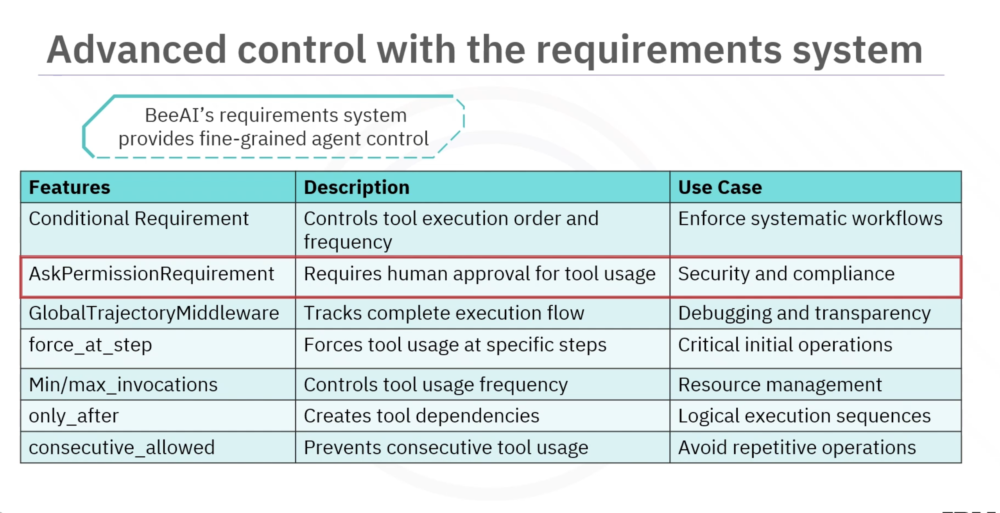

# 🐝 BeeAI Agents & Multi-Agent Systems – Notes

## 📌 Overview

* BeeAI enables building **intelligent agents** and **multi-agent systems**
* Agents:

  * Maintain **persistent state**
  * Use **external tools**
  * Follow **behavioral requirements**

---

## 🤖 RequirementAgent

### What is it?

* Core class for building **controllable AI agents**
* More advanced than simple chat models

### Key Features

* Persistent memory
* Tool usage
* Requirement-based behavior control

### Basic Setup

```python
agent = RequirementAgent(
    llm=llm,
    memory=UnconstrainedMemory(),
    system_prompt="You are a helpful assistant"
)

result = await agent.async_run(input)
```

---

## 🧠 Memory (UnconstrainedMemory)

* Stores full conversation history
* Provides **context across interactions**

---

## 🔧 Adding Tools to Agents

### Example: Wikipedia Tool

* Import:

  * `WikipediaTool`
  * `ConditionalRequirement`

* Add tool:

```python
tools=[WikipediaTool()]
```

* Control usage:

```python
requirements=[
    ConditionalRequirement(tool=WikipediaTool, max_invocations=1)
]
```

### Benefit

* Access **real-time or external knowledge**

---

## 💭 ThinkTool (Systematic Reasoning)

### Purpose

* Enables **explicit reasoning before answering**

### Setup

```python
tools=[ThinkTool()]

requirements=[
    ConditionalRequirement(tool=ThinkTool, max_invocations=3)
]
```

### Benefit

* Improves **accuracy and reasoning quality**

---

## ⚙️ Requirements System (Core Control Layer)

### Purpose

* Fine-grained control over:

  * Tool usage
  * Execution order
  * Agent behavior

### Key Features

| Feature                       | Description                    |
| ----------------------------- | ------------------------------ |
| `ConditionalRequirement`      | Control tool frequency & order |
| `AskPermissionRequirement`    | Require human approval         |
| `force_at_step`               | Force tool at specific step    |
| `min/max_invocations`         | Limit tool usage               |
| `only_after`                  | Create dependencies            |
| `consecutive_allowed`         | Control repetition             |
| `ControlTrajectoryMiddleware` | Track execution flow           |


---

## 🔁 ReAct Pattern (Reason + Act)

### Concept

* Agent cycles between:

  * **Thinking**
  * **Acting**
  * **Observing**

### Implementation

* Tools:

  * `ThinkTool`
  * `WikipediaTool`

* Middleware:

  * `GlobalTrajectoryMiddleware`

### Key Requirements

```python
requirements=[
    ConditionalRequirement(ThinkTool, force_at_step=1),
    ConditionalRequirement(ThinkTool, force_after=Tool),
    ConditionalRequirement(ThinkTool, max_invocations=3, consecutive_allowed=False)
]
```

### Benefits

* Transparent reasoning
* Self-correction
* Debuggable workflows

---

## 🔐 Human-in-the-Loop (Security)

### AskPermissionRequirement

* Ensures **human approval before actions**

### Example

```python
requirements=[
    AskPermissionRequirement(tool=WikipediaTool)
]
```

### Benefits

* Safer AI systems
* Compliance & risk control
* Transparent decision-making

---

## 🛠️ Custom Tools

### Why?

* Add **domain-specific capabilities**

### Steps

#### 1. Define Input Schema

```python
class MathInput(BaseModel):
    a: int
    b: int
```

#### 2. Create Tool

```python
class AddTool(Tool):
    name = "add"
    description = "Adds two numbers"
    input_schema = MathInput

    async def _run(self, input):
        return input.a + input.b
```

### Benefit

* Extend agent functionality beyond built-in tools

---

## 🤝 Multi-Agent Systems

### Concept

* Multiple specialized agents **collaborate**

### Key Component

* `HandoffTool` → delegates tasks between agents

### Workflow

1. Create specialized agents
2. Wrap each with `HandoffTool`
3. Create a **Coordinator Agent**
4. Route user query → Coordinator → delegates tasks

### Benefits

* Task specialization
* Scalable architecture
* Better problem solving

---

## 🌟 Key Takeaways

* **RequirementAgent** → core for building agents
* **Tools** → extend capabilities
* **ThinkTool** → enables reasoning
* **Requirements system** → precise control
* **ReAct pattern** → reasoning + acting loop
* **AskPermissionRequirement** → secure workflows
* **Custom tools** → domain-specific logic
* **Multi-agent systems** → collaborative intelligence

---

## 🧾 Summary

BeeAI provides a **powerful agent framework** with:

* Persistent memory
* Tool integration
* Fine-grained behavioral control
* Secure, human-in-the-loop workflows
* Multi-agent collaboration
