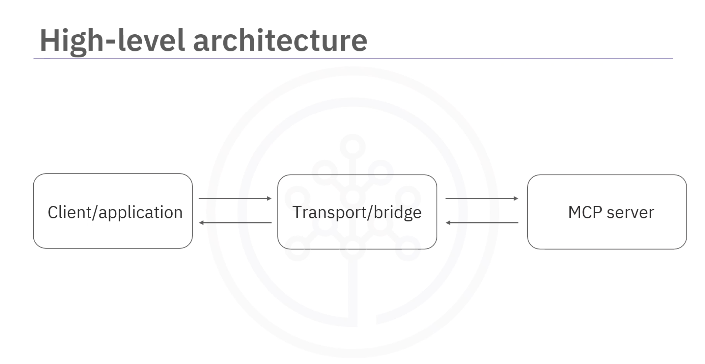

# 📘 Running Existing MCP Servers

## 🎯 Learning Objectives

After this video, you should be able to:

* Create a client to connect to MCP servers
* Describe the two main transport mechanisms
* Explore and call tools from an MCP server

---

## 🏗️ MCP Servers Overview

* **MCP servers** act like **remote function libraries**
* Tools run **remotely**; client code connects over the network
* Each server exposes **tools**, e.g., `add` or `multiply`
* Usage pattern:

  1. Set tool name and parameters (`a=1`, `b=2`)
  2. Call tool via client → result returned through transport

---

## 🔌 Transport Mechanisms

### 1. STDIO (Standard Input/Output)

* For **local servers**
* Client uses **STDIN** to send messages
* Server uses **STDOUT** to respond
* Ideal for:

  * Testing
  * Local development
* Python usage:

  * Async context manager ensures non-blocking operations
  * `async with stdio_client as client` handles connection setup & cleanup

### 2. HTTP (Hypertext Transfer Protocol)

* For **remote servers**
* Client sends **HTTP requests**, server responds with **HTTP responses**
* Supports:

  * Web tools
  * Cloud services
* Bidirectional communication over standard web protocols
* Python usage:

  * `streamable HTTP transport` object → `HTTP_client`
  * Async calls identical to STDIO workflow

### Other Transport Options

* **Server-Sent Events (SSE)** → legacy, replaced by streamable HTTP
* **In-memory transport** → direct calls within same Python process (for dev/testing)

---

## 🧩 MCP Client Workflow

1. **Create transport object**

   * `stdio_transport` → local server
   * `HTTP_transport` → remote server

2. **Initialize client**

   ```python
   client = Client(transport)
   ```

3. **List available tools**

   ```python
   tools = await client.list_tools()
   ```

   * Returns tool objects (`name`, `description`, `input schema`)

4. **Call a tool**

   ```python
   result = await client.call_tool(tool_name, **params)
   ```

   * Example:

     * Tool: `resolve-library-id`
     * Param: `library_name = "FastMCP"`
     * Output: Context7-compatible library ID

5. **Retrieve documentation**

   * Tool: `get-library-docs`
   * Parameters: `library_id`, `token_limit`
   * Returns: LLM-ready code snippets, docs, metadata

---

## 🧠 Key Concepts

* MCP clients work **identically across transports** (STDIO / HTTP)
* Async-await pattern → **non-blocking communication**
* Tools are **standardized** across MCP
* MCP adapters exist (e.g., **LangChain**) to convert tools for specific frameworks
* MCP servers form the **bridge between LLMs and external tools/services**

---

## ✅ Summary

* MCP servers enable **remote execution of tools**
* **STDIO** → local communication, **HTTP** → remote communication
* **Client API is consistent**, transport-agnostic
* Async-await ensures **concurrent, non-blocking operations**
* MCP supports **LLM-ready documentation** for code libraries
* MCP is the foundation for **next-gen LLM-powered applications**

