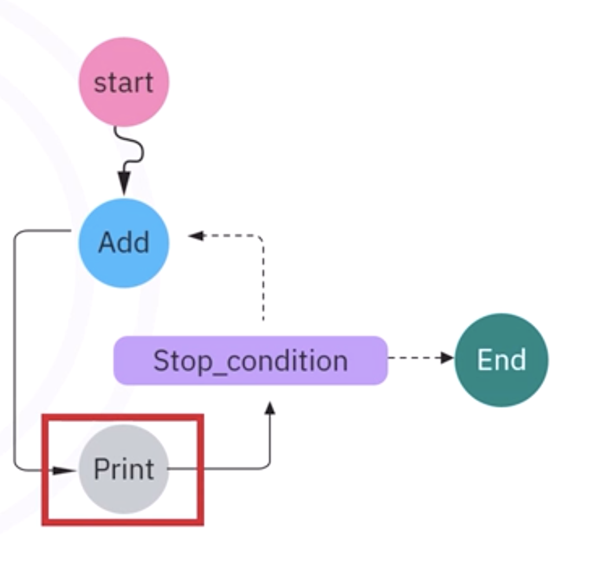

# **LangGraph 101 – Getting Started**

## **1. Overview**

* **LangGraph**: Framework for **stateful, multi-agent applications**.
* Represents **agent workflows as graphs**: nodes, edges, and state.
* Supports **dynamic workflows** with looping and conditional branching.
* Visualize execution and state progression for debugging and understanding.

---

## **2. State in LangGraph**

* **State**: central memory holding **inputs, intermediate values, outputs**.
* Can be complex: **TypedDict, lists, nested structures, message sequences**.
* Example: Counter with `n` (integer) and `letter` (string).
* Defined with **TypedDict** and **typing module** for type safety.
* **Chain state object**: represents a row of data; can be updated by nodes.

---

## **3. Nodes**

* **Nodes**: functions that **process state**.
* Can **modify state** (e.g., increment `n`, generate letter) or **produce side effects** (e.g., print).
* Return **updated state** (keys/values are critical).
* Node names are identifiers; **can differ from function names**.

---

## **4. Edges**

* **Edges**: define **execution flow between nodes**.
* **Special edges** allow **conditional routing** based on state.
* Example: `stop_condition` checks if `n >= 13` → routes to `end` or loops back to `add`.
* Conditional edges can use:

  1. **Dictionary mapping**: map outputs to destination nodes.
  2. **Function returning next node name**: dynamic routing based on state.

---

## **5. Building a Workflow**

1. **Create state graph object** with TypedDict state class.
2. **Add nodes** with `add_node(node_name, function)`.
3. **Connect nodes** with `add_edge(start_node, destination_node)`.
4. **Add conditional edges** with `add_conditional_edges(node_name, condition_function, mapping_dict)`.
5. **Set entry point** with `set_entry_point(start_node)`.
6. **Compile graph** → runnable application.
7. **Invoke workflow** with initial state: `app.invoke({'n': 1, 'letter': ''})`.

---

## **6. Workflow Execution Example**

* **Initial State:** `n = 1, letter = ''`
* **Step 1:** `add` node → increment `n`, generate random letter.
* **Step 2:** `print` node → outputs current state.
* **Step 3:** `stop_condition` node → checks `n >= 13`.

  * **False:** loops back to `add` node.
  * **True:** routes to `end`.
* **Result:** final state stored in `result` variable after workflow completes.

---

## **7. Key Takeaways**

* **State:** evolving memory across workflow.
* **Nodes:** functions that process or modify state.
* **Edges:** define flow; conditional edges allow **dynamic decisions**.
* **Workflow setup:** create state graph → add nodes → connect edges → set entry → compile → invoke.
* **Visualization:** helps understand execution flow and state progression.
