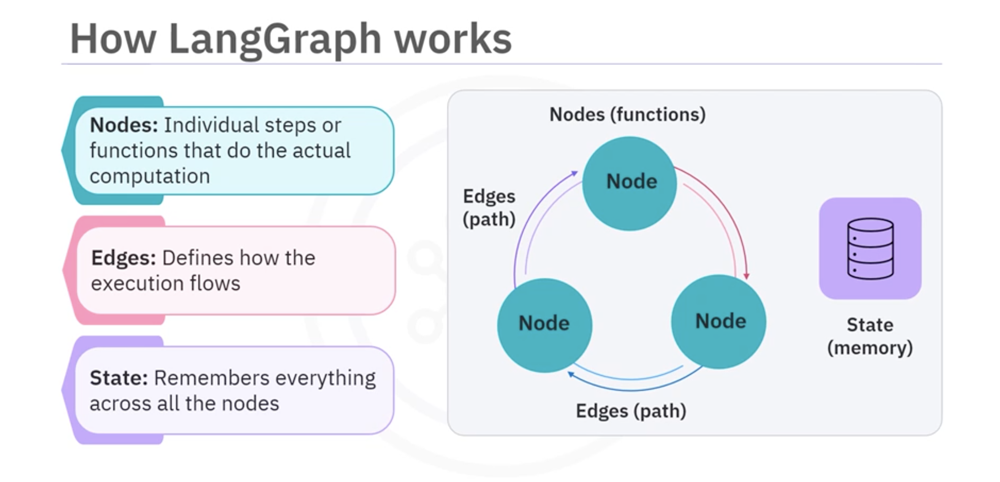
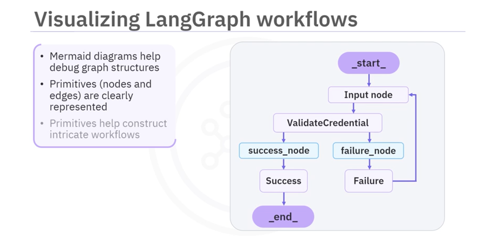

# **LangGraph: Core Components and Capabilities**

## **1. Overview**

* Framework in the **LangChain ecosystem** for **stateful, multi-agent applications**.
* **Low-level & flexible** — gives full control without restrictive abstractions.
* Models **agent workflows as graphs**: nodes, edges, and state.

---

## **2. Graph Structure**

### **Nodes**

* Represent individual **steps or functions** that perform computation.
* Can be **developed and tested independently** (modularity).

### **Edges**

* Define the **execution flow** between nodes.
* Enable **conditional transitions** for dynamic decision-making.

### **State**

* Shared memory across all nodes.
* Maintains **context over long interactions**.
* Supports **modification and persistence** for complex workflows.

---

## **3. Unique Capabilities**

1. **Looping & Branching**

   * Enables **dynamic decisions** during execution.
2. **State Persistence**

   * Maintains context over multiple steps or interactions.
3. **Human-in-the-loop**

   * Allows **manual intervention** when needed.
4. **Time Travel**

   * Rewind workflow to **previous states** for debugging.
5. **Enhanced Observability**

   * Clear insights into execution path for **debugging & monitoring**.

---

## **4. Advantages over Traditional Programming**

| Feature            | Traditional Loops / If Statements | LangGraph                          |
| ------------------ | --------------------------------- | ---------------------------------- |
| Context            | Linear, no shared memory          | Stateful across nodes              |
| Decision Making    | Static conditional checks         | Dynamic branching at runtime       |
| Modularity         | Limited                           | Independent reusable nodes         |
| Observability      | Hard to trace                     | Visualized via workflow graphs     |
| Human Intervention | Difficult                         | Built-in human-in-the-loop support |

---

## **5. Use Cases**

* **Sophisticated AI agents** requiring **dynamic decision-making & adaptability**.
* Example: **Customer support agent**

  * Traditional loop: asks until valid input, **no memory of past topics**.
  * LangGraph workflow: branches, loops, pauses for human input, **retains full conversational memory**.

---

## **6. Visualization**

* Graphs can be visualized using **Mermaid diagrams**.
* Core primitives (nodes & edges) are **clearly represented**.
* Helps in **understanding and debugging workflows**.

---

## **7. Key Takeaways**

* **Nodes:** computation steps.
* **Edges:** execution flow.
* **State:** shared memory across nodes.
* **Capabilities:** looping, branching, state persistence, human-in-the-loop, time travel.
* **Advantages:** dynamic workflows, modularity, conditional transitions, enhanced observability.
* Ideal for **complex, multi-agent AI applications**.

