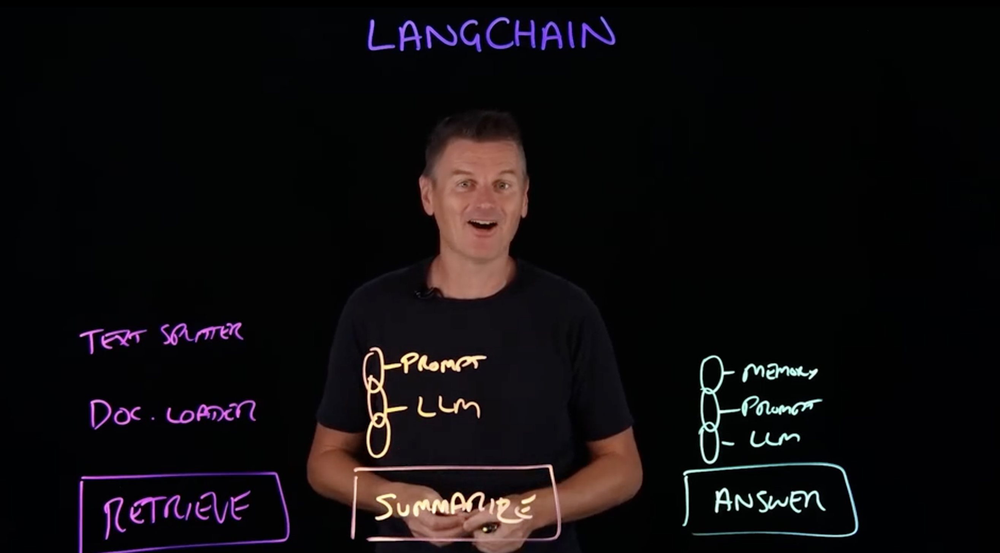
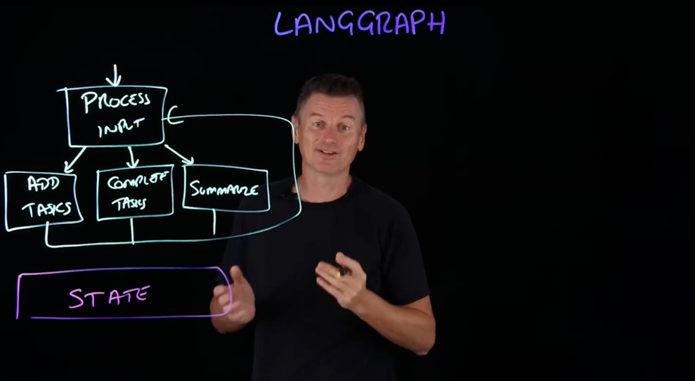
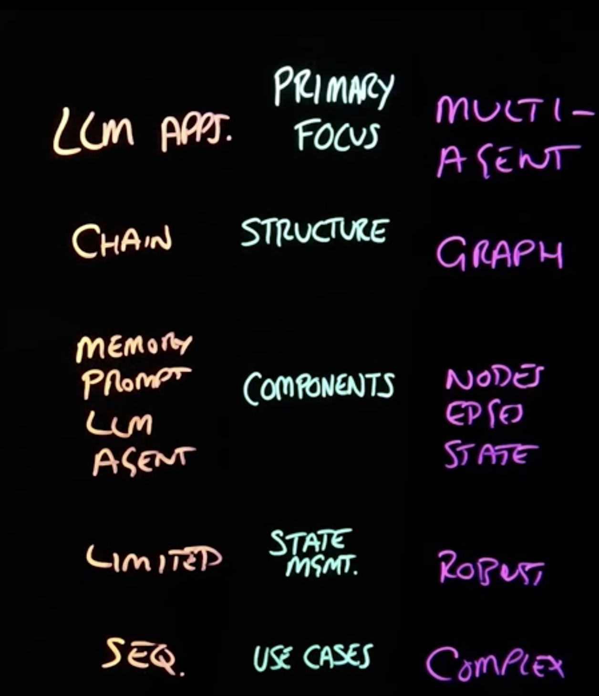

# **LangChain vs LangGraph**

## **1. Overview**

| Framework     | Purpose                                                                       | Key Strength                                      |
| ------------- | ----------------------------------------------------------------------------- | ------------------------------------------------- |
| **LangChain** | Build LLM-powered applications via **sequential function execution (chains)** | Simplifies LLM workflows with modular components  |
| **LangGraph** | Build **stateful, multi-agent systems** with **non-linear workflows**         | Handles complex, interactive, context-aware tasks |

---

## **2. Structure**

| Feature          | LangChain                                        | LangGraph                                                         |
| ---------------- | ------------------------------------------------ | ----------------------------------------------------------------- |
| Workflow         | **Chain** (DAG — Directed Acyclic Graph)         | **Graph** (Nodes + Edges + State)                                 |
| Flow             | Linear/sequential execution                      | Flexible: loops, branching, revisit states                        |
| Components       | LLM, Prompt, Memory, Agent, Chain                | Nodes (actions), Edges (transitions), State (shared memory)       |
| State Management | Limited: memory components store partial context | Robust: all nodes can access and modify state across interactions |

---

## **3. Core Concepts**

### **LangChain**

1. **Retrieve → Summarize → Answer** workflow
2. Components:

   * **Document Loader:** fetch content
   * **Text Splitter:** chunk large documents
   * **Chain:** orchestrates tasks
   * **Memory:** stores conversational context
   * **Prompt + LLM:** generate outputs

### **LangGraph**

1. **Graph-based agent workflow**
2. Components:

   * **Nodes:** individual actions (e.g., add task, complete task, summarize)
   * **Edges:** define execution path
   * **State:** persistent memory shared across nodes
   * **Central Node:** process input → routes to appropriate node

---

## **4. State Management**

| Feature                 | LangChain                                 | LangGraph                                         |
| ----------------------- | ----------------------------------------- | ------------------------------------------------- |
| Persistence             | Limited, forward passing in chain         | Robust, all nodes access & modify state           |
| Context                 | Can store conversation history via memory | Maintains full context for long interactions      |
| Dynamic Decision-Making | Limited                                   | Conditional branching, looping, human-in-the-loop |

---

## **5. Use Cases**

### **LangChain**

* Sequential tasks:

  * Retrieve data → Summarize → Answer questions
* Simple workflows with modular LLM operations

### **LangGraph**

* Complex, interactive tasks:

  * Virtual assistants managing tasks, conversations, or adaptive multi-agent systems
* Maintains **stateful, context-aware interactions**
* Handles **non-linear workflows** requiring loops, branches, or revisits

---

## **6. Key Takeaways**

* **LangChain:** Best for **linear LLM workflows**, sequential task execution, modular chaining.
* **LangGraph:** Best for **stateful, multi-agent systems**, non-linear workflows, dynamic user interactions.
* Both are **open-source** and complement each other within the **LangChain ecosystem**.
