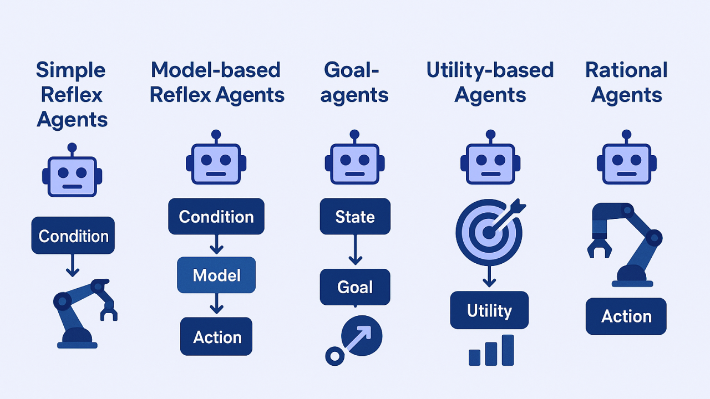

# Types of AI Agents

New **agentic workflows and AI models** are constantly being released. Often, these releases come with claims that tasks once requiring human expertise can now be fully automated. To better understand these systems, it's helpful to distinguish between different **types of AI agents** based on:

- Their **level of intelligence**
- Their **decision-making process**
- How they **interact with their environment**

There are **five main types of AI agents**.

---

# 1. Simple Reflex Agent

A **Simple Reflex Agent** is the most basic type of AI agent.

It:
- Follows **predefined rules**
- Reacts directly to **current input**
- Does **not store past information**

### Example
A **thermostat**:
- If temperature drops below a threshold → **turn on heat**
- If temperature reaches target → **turn off heat**

### Architecture

1. **Environment**
   - The external world the agent interacts with.

2. **Sensors**
   - Collect input from the environment.

3. **Percepts**
   - The perceived inputs from sensors.

4. **Condition-Action Rules**
   - Core logic using:
```

IF condition THEN action

```

5. **Actuators**
- Execute the chosen action.

6. **Action**
- Output behavior that affects the environment.

### Loop

```

Environment → Sensors → Percepts → Rules → Action → Environment

```

### Limitations

- No memory
- Cannot learn
- Repeats mistakes if rules are incomplete
- Struggles in **dynamic environments**

---

# 2. Model-Based Reflex Agent

A **Model-Based Reflex Agent** improves on simple reflex agents by **maintaining an internal model of the world**.

### Key Idea

It keeps track of:

- **Internal State**
- **How the environment changes**
- **How its actions affect the environment**

### Components

- **State**
  - Internal memory of the environment.

- **Model of the World**
  - Predicts how the environment evolves.

- **Action Effects**
  - Tracks consequences of actions.

### Example: Robotic Vacuum Cleaner

The vacuum remembers:

- Where it has already cleaned
- Where obstacles are
- Current location

Example rule:

```

IF current area is dirty AND not cleaned
THEN vacuum

```

### Advantage

- Can **infer parts of the environment it cannot currently observe**
- Maintains **memory**

### Limitation

Still **reactive** — does not plan ahead.

---

# 3. Goal-Based Agent

A **Goal-Based Agent** introduces **goal-directed behavior**.

Instead of simple rules, the agent asks:

> "Which action helps me achieve my goal?"

### Key Components

- **Goal**
- **Internal Model**
- **Prediction of future states**

### Decision Process

1. Observe current state
2. Predict outcomes of possible actions
3. Select action that **moves closer to the goal**

### Example: Self-Driving Car

Goal: **Reach destination X**

Process:

1. Current state: on Main Street
2. Predict action outcome:
   - Turn left → reach highway
3. Evaluate:
   - Does it help reach destination?
4. Execute action.

### Characteristics

- Uses **planning**
- Uses **prediction**
- Focused on **goal achievement**

---

# 4. Utility-Based Agent

A **Utility-Based Agent** goes beyond goals by evaluating **how desirable outcomes are**.

Instead of asking:

> "Does this achieve the goal?"

It asks:

> "Which option gives the best outcome?"

### Utility

A **utility function** assigns a value to each possible outcome.

This value represents:

- Preference
- Satisfaction
- Performance score

### Decision Process

1. Predict possible outcomes
2. Assign **utility scores**
3. Choose action with **maximum expected utility**

### Example: Autonomous Delivery Drone

Goal-based version:
- Deliver package to address.

Utility-based version considers:

- Speed
- Safety
- Battery usage
- Weather

It chooses the route with **highest utility score**.

### Advantage

Optimizes for **best outcome**, not just goal completion.

### Challenge

Requires a **well-defined utility function**.

---

# 5. Learning Agent

A **Learning Agent** improves its performance over time through **experience**.

Instead of being fully programmed, it **learns from feedback**.

### Core Components

1. **Performance Element**
   - Chooses actions.

2. **Critic**
   - Evaluates results of actions.

3. **Learning Element**
   - Updates the agent's knowledge.

4. **Problem Generator**
   - Suggests exploration of new actions.

### Learning Process

```

Action → Environment Response → Critic Feedback → Learning Update

```

Often uses **Reinforcement Learning**.

### Example: AI Chess Bot

- **Performance Element**: plays the game
- **Critic**: evaluates win/loss
- **Learning Element**: improves strategy
- **Problem Generator**: explores new moves

### Advantages

- Learns from experience
- Improves over time
- Highly adaptable

### Drawbacks

- Requires large amounts of data
- Learning process can be slow

---

# Summary of Agent Types

| Agent Type | Key Capability | Limitation |
|-------------|---------------|-------------|
| Simple Reflex Agent | Reacts to current input | No memory |
| Model-Based Reflex Agent | Remembers environment state | No planning |
| Goal-Based Agent | Plans actions toward goals | Doesn't optimize outcome quality |
| Utility-Based Agent | Chooses best possible outcome | Requires utility function |
| Learning Agent | Improves from experience | Data intensive |

---

# Multi-Agent Systems

Often, multiple agents operate together in a **shared environment**.

This is called a **Multi-Agent System (MAS)**.

Agents can:

- **Cooperate**
- **Coordinate**
- **Compete**

to achieve complex goals.

---

# Human-in-the-Loop

Even as AI agents become more capable, **human oversight remains important**.

Humans help with:

- Supervision
- Ethical decisions
- Exception handling
- Strategic direction

For now, **the best systems combine AI agents with human expertise**.
```
