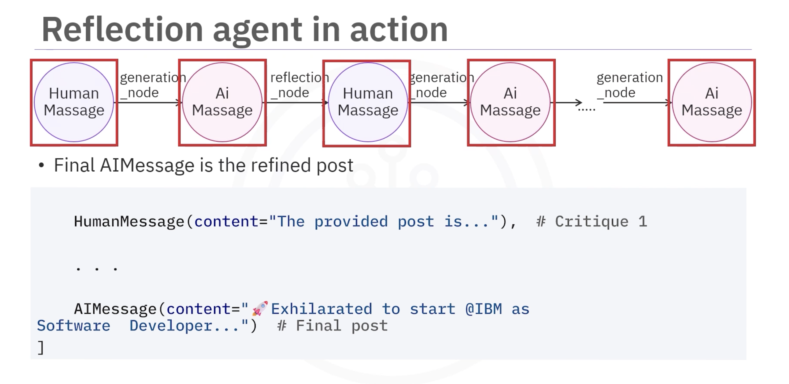

# Reflection Agents: The Art of AI Self-Improvement

Reflection agents are AI systems designed to **improve their outputs by analyzing and critiquing their own performance**.  
They iteratively refine responses through a **feedback loop between generation and reflection**.

The core idea:  
> AI improves by **learning from its mistakes**.

---

# Types of Reflection Agents

Reflection-based systems generally fall into three categories:

1. **Basic Reflection Agent**
2. **Reflexion Agent**
3. **Language Agent Tree Search (LATS)**

This guide focuses on the **Basic Reflection Agent**.

---

# Core Idea of a Reflection Agent

A reflection agent uses **two LLM roles**:

1. **Generator**
2. **Reflector**

### Workflow

```

User Prompt
↓
Generator (creates response)
↓
Reflector (critiques response)
↓
Generator (improves response)
↓
Loop until stopping condition

```

This iterative loop produces **higher-quality outputs**.

---

# Example: "How Do I Look Cool?"

### User Prompt

```

How do I look cool?

```

---

## Iteration 1

### Generator Output

```

Wear a fedora.

```

### Reflector Critique

```

Fedoras are outdated and often stereotyped negatively.

```

---

## Iteration 2

### Generator Output

```

Wear well-fitted clothes, maintain good posture,
and be confident. Authenticity beats trying to look cool.

```

### Reflector Critique

```

Good advice focused on authenticity.
Could add something about personal style.

```

---

## Final Output

```

Find clothes that match your personal style,
maintain good posture, and be confident.
True coolness comes from authenticity, not trends.

```

---

# Practical Use Case: LinkedIn Post Optimization Agent

A reflection agent can **improve social media content automatically**.

### Workflow

1. **Post Generation Phase**
2. **Reflection / AI Review Phase**
3. **Iterative Refinement**

```

Human Prompt
↓
Generator → Draft Post
↓
Reflector → Critique
↓
Generator → Improved Post
↓
Repeat until stop condition

````

---

# Implementing Reflection Agents with LangChain

The first step is **initializing the LLM**.

Example uses:

- **IBM Granite model**
- **LangChain**

---

## Generator Prompt

Use **ChatPromptTemplate**.

Components:

- **SystemMessage**
- **MessagesPlaceholder**

### Purpose

- Define the LLM role
- Maintain memory of previous messages

Example concept:

```python
generate_prompt = ChatPromptTemplate.from_messages([
    SystemMessage("You are a professional LinkedIn content creator."),
    MessagesPlaceholder("messages")
])
````

Then connect the prompt to the LLM:

```python
generate_chain = generate_prompt | llm
```

---

# Reflection Prompt

The reflector critiques the generated output.

The system prompt defines the model as a **LinkedIn content strategist**.

Example structure:

```python
reflection_prompt = ChatPromptTemplate.from_messages([
    SystemMessage("You are a professional LinkedIn content strategist."),
    MessagesPlaceholder("messages")
])
```

Connect the prompt:

```python
reflect_chain = reflection_prompt | llm
```

---

# Building the Agent with LangGraph

LangGraph enables **workflow orchestration for AI agents**.

### Key Component: MessageGraph

`MessageGraph` is a special graph type that stores:

* `HumanMessage`
* `AIMessage`
* `SystemMessage`

It acts as **agent memory**, accumulating messages during iterations.

---

# Agent State

The state contains a **list of messages**.

Example state structure:

```
[
  HumanMessage,
  AIMessage,
  HumanMessage (critique),
  AIMessage (improved response)
]
```

This grows with every iteration.

---

# Generation Node

The generation node:

1. Receives conversation state
2. Sends messages to the generator chain
3. Produces an AI response

Example concept:

```python
def generation_node(state):
    response = generate_chain.invoke(state)
    return AIMessage(content=response)
```

This response is **appended to the state automatically**.

---

# Reflection Node

The reflection node critiques the generator output.

Important detail:

The reflection response is returned as a **HumanMessage**.

### Why?

Because the generator expects **human input**.

Example concept:

```python
def reflection_node(messages):
    critique = reflect_chain.invoke(messages)
    return HumanMessage(content=critique)
```

This allows the reflector to **act like a user requesting improvements**.

---

# Building the Graph

Add nodes to the workflow:

```python
graph.add_node("generate", generation_node)
graph.add_node("reflect", reflection_node)
```

---

# Connecting Nodes

Define execution flow using edges:

```python
graph.add_edge("reflect", "generate")
```

This creates the **feedback loop**.

---

# Entry Point

Define where the workflow starts.

```python
graph.set_entry_point("generate")
```

---

# Router Node (Stopping Condition)

Use a router function to decide whether to:

* Continue refining
* End the workflow

Example:

```python
def should_continue(messages):
    if len(messages) > 6:
        return "end"
    return "reflect"
```

Add conditional edges:

```python
graph.add_conditional_edges(
    "generate",
    should_continue,
    {"reflect": "reflect", "end": END}
)
```

---

# Compile the Workflow

Finalize the graph:

```python
workflow = graph.compile()
```

---

# Running the Reflection Agent

Define the initial user prompt:

```python
HumanMessage(
  "Write a LinkedIn post on getting a software developer job at IBM under 160 characters."
)
```

Run the workflow:

```python
workflow.invoke(input)
```

---

# Example Execution Flow

```
HumanMessage
      ↓
Generation Node
      ↓
AIMessage (first draft)
      ↓
Reflection Node
      ↓
HumanMessage (critique)
      ↓
Generation Node
      ↓
AIMessage (improved draft)
      ↓
Repeat
```

Each iteration **adds messages to the state**.

The final AIMessage becomes the **refined output**.

---

# Key Concepts Learned

## 1. Reflection Loop

Reflection agents improve outputs through **iterative self-critique**.

```
Generate → Critique → Improve
```

---

## 2. Generator vs Reflector

| Role      | Responsibility                      |
| --------- | ----------------------------------- |
| Generator | Produces content                    |
| Reflector | Critiques and suggests improvements |

---

## 3. Prompt Engineering with LangChain

LangChain enables structured prompting with:

* `ChatPromptTemplate`
* `SystemMessage`
* `MessagesPlaceholder`

---

## 4. Agent State in LangGraph

`MessageGraph` stores:

* conversation history
* iterative improvements
* critique feedback

---

## 5. Graph Workflow

Agent workflows involve:

* **Nodes** → functions
* **Edges** → execution flow
* **Router nodes** → decision logic
* **Entry points** → workflow start

---

# Final Takeaway

Reflection agents enable **self-improving AI systems** by introducing a **structured feedback loop** between generation and critique.

They are useful for:

* content optimization
* code improvement
* reasoning refinement
* AI quality control

This approach is a **foundation for more advanced agentic systems** like:

* Reflexion
* Language Agent Tree Search (LATS)


