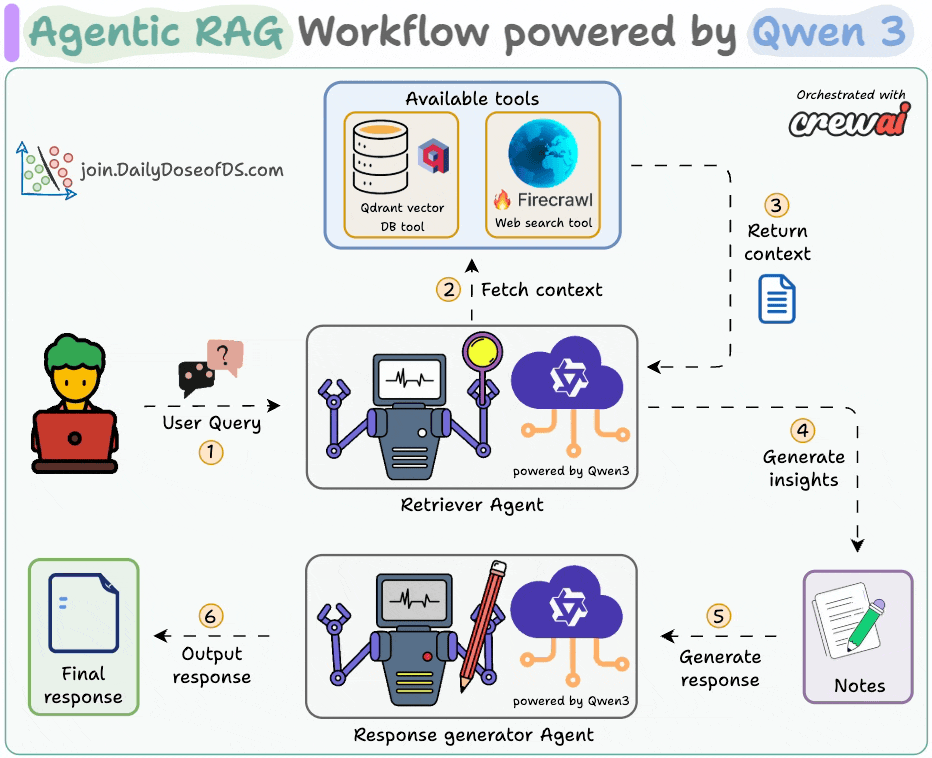

# Agentic RAG – Revision Notes



## 1. Retrieval Augmented Generation (RAG)

**Retrieval Augmented Generation (RAG)** is a pipeline that improves responses from a **Large Language Model (LLM)** by retrieving relevant information from an external data source before generating the answer.

### Core Idea

Instead of relying only on the model’s training data, RAG:

1. Retrieves relevant information.
2. Adds it as **context in the prompt**.
3. Sends it to the **LLM for generation**.

This leads to:

* More **accurate**
* More **grounded**
* More **reliable** responses.

---

## 2. Basic LLM Pipeline (Without RAG)

```
User Query
    ↓
Prompt Construction
    ↓
LLM
    ↓
Generated Response
```

### Limitations

* Relies only on the **model’s internal knowledge**
* May produce **hallucinations**
* Cannot access **external or updated data**

---

## 3. Standard RAG Pipeline

RAG introduces a **Vector Database** to retrieve relevant context.

```
User Query
    ↓
Vector Database Search
    ↓
Retrieved Context
    ↓
Prompt Construction
    ↓
LLM
    ↓
Generated Response
```

### Key Component

**Vector Database**

* Stores embeddings of documents
* Retrieves relevant chunks using similarity search

### Typical RAG Behavior

* LLM is **called once**
* Used only for **response generation**

---

# 4. Agentic RAG

**Agentic RAG** enhances RAG by using the **LLM as an intelligent agent**, not just a generator.

### Key Idea

The LLM can:

* Make **decisions**
* Choose **data sources**
* Determine **response format**

---

## 5. Responsibilities of the Agent

The LLM agent can:

### 1. Select Data Sources

Choose which database to query.

### 2. Decide Response Type

Determine whether to return:

* Text explanation
* Chart
* Code snippet
* Structured data

### 3. Handle Edge Cases

Route unrelated queries to a **fail-safe response**.

---

# 6. Example Architecture (Agentic RAG)

```
                 ┌──────────────┐
                 │   User Query  │
                 └──────┬───────┘
                        ↓
                  LLM Agent
                        ↓
        ┌───────────────┼───────────────┐
        ↓                               ↓
Internal Documentation DB        General Knowledge DB
(policies, procedures)           (industry standards)

        ↓                               ↓
     Retrieved Context            Retrieved Context
        └───────────────┬───────────────┘
                        ↓
                 Prompt Construction
                        ↓
                       LLM
                        ↓
                  Final Response
```

---

# 7. Example Databases

### Internal Documentation

Contains:

* Company policies
* Procedures
* Guidelines

Example question:

> "What’s the company policy on remote work during holidays?"

Agent routes query → **Internal Documentation DB**

---

### General Knowledge Base

Contains:

* Industry standards
* Best practices
* Public resources

Example question:

> "What are industry standards for remote work in tech?"

Agent routes query → **General Knowledge DB**

---

# 8. Fail-Safe Handling

Some queries are **irrelevant to available databases**.

Example:

> "Who won the World Series in 2015?"

Agent behavior:

1. Recognizes query is **out-of-domain**
2. Routes to **fail-safe**
3. Returns:

```
"Sorry, I don't have the information you're looking for."
```

---

# 9. Advantages of Agentic RAG

### 1. Better Context Understanding

Agent interprets the **intent of queries**.

### 2. Intelligent Routing

Chooses the **most relevant data source**.

### 3. Reduced Noise

Avoids retrieving irrelevant data.

### 4. Flexible Outputs

Supports multiple response formats.

### 5. More Accurate Responses

Uses the **best possible context**.

---

# 10. Use Cases

### Customer Support

* Retrieve answers from **internal help docs**

### Legal Tech

* Internal briefs
* Public case law databases

### Healthcare

* Clinical guidelines
* Research publications

### Enterprise Knowledge Systems

* Internal documentation
* Industry knowledge

---

# 11. Key Difference: RAG vs Agentic RAG

| Feature        | Standard RAG       | Agentic RAG                   |
| -------------- | ------------------ | ----------------------------- |
| LLM Role       | Generates response | Acts as decision-making agent |
| Data Source    | Usually one        | Multiple sources              |
| Query Routing  | Static             | Intelligent                   |
| Output Type    | Text               | Multiple formats              |
| Error Handling | Limited            | Fail-safe routing             |

---

# 12. Summary

**Agentic RAG = RAG + Intelligent Decision-Making**

Instead of just retrieving context and generating responses, the system:

* Uses an **LLM agent**
* **Analyzes query intent**
* **Chooses the best data source**
* **Handles irrelevant queries**
* **Generates richer responses**

This results in AI systems that are:

* More **adaptive**
* More **accurate**
* Better at **understanding context**
