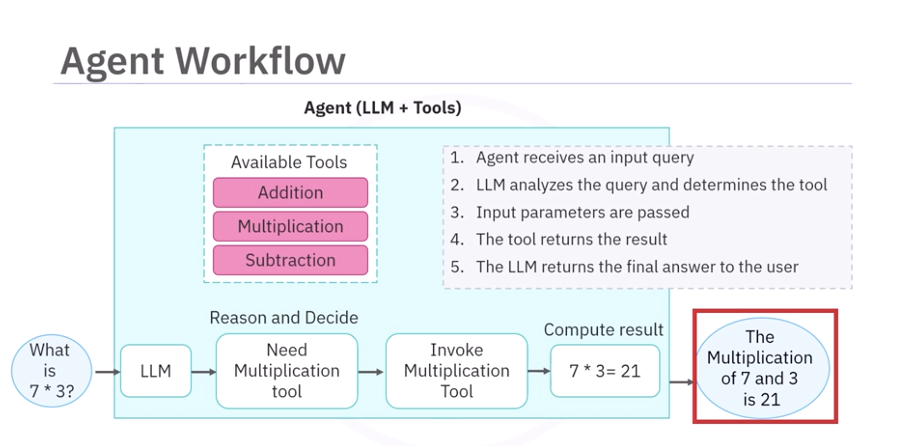

# Build a Custom Math Toolkit Agent with LangChain

## 1. Overview

This lesson explains how to build **custom agents using LangChain and LangGraph**.

You will learn to:

- Build **ReAct-style agents**
- Create **custom math tools**
- Use **LangGraph for flexible agent workflows**
- Guide agent behavior using **custom prompts**
- Combine **calculation tools + information retrieval tools**

---

# 2. LangGraph vs `initialize_agent`

Previously:
```

initialize_agent()

```

Used for:
- quick agent setup
- predefined strategies

Examples:
- ReAct agents
- Structured Chat agents

### Limitation
Less flexibility for complex workflows.

---

## LangGraph

LangGraph is becoming the **preferred approach** for building agents.

Benefits:

- More **flexibility**
- Better **multi-step workflows**
- Better **control over reasoning**
- Custom **prompt templates**

Key function:

```

create_react_agent()

```

---

# 3. ReAct Agent with LangGraph

ReAct = **Reason + Act**

Agent workflow:

```

User Query
↓
LLM reasoning
↓
Tool selection
↓
Tool execution
↓
Observation
↓
Final response

````

---

# 4. Creating a ReAct Agent

Import:

```python
from langgraph.prebuilt import create_react_agent
````

Create agent:

```python
agent = create_react_agent(
    llm,
    tools
)
```

Optional:

```
prompt = custom system prompt
```

Used to guide agent behavior.

---

# 5. Structured Tool Example

Before building the agent, define tools.

Example tool:

```
sum_numbers_with_complex_output
```

Purpose:

* Extract numbers
* Perform summation
* Return result

Tools are passed to the agent as a list.

Example:

```python
tools = [sum_numbers_with_complex_output]
```

---

# 6. Interacting with the Agent

Use the **invoke method**.

Example:

```python
response = agent.invoke({
 "messages": [
   {"role": "human", "content": "Add -10, -20, -30"}
 ]
})
```

---

## Response Structure

The response includes:

* message history
* tool calls
* intermediate reasoning
* final answer

Example extraction:

```
response["messages"]
```

---

# 7. Multi-Tool Agents

Real-world agents usually need **multiple tools**.

Example: Banking Agent

| Tool     | Purpose      |
| -------- | ------------ |
| deposit  | add funds    |
| withdraw | remove funds |
| transfer | move money   |

Example: Math Agent

| Tool     | Purpose        |
| -------- | -------------- |
| add      | addition       |
| subtract | subtraction    |
| multiply | multiplication |
| divide   | division       |

---

# 8. Building a Math Toolkit

Create four tools:

### Addition Tool

```
add_numbers
```

### Subtraction Tool

```
subtract_numbers
```

### Multiplication Tool

```
multiply_numbers
```

### Division Tool

```
divide_numbers
```

Add them to a list:

```python
tools = [
 add_numbers,
 subtract_numbers,
 multiply_numbers,
 divide_numbers
]
```

---

# 9. Creating the Math Agent

Create agent with tools.

Example:

```python
agent = create_react_agent(
    llm,
    tools,
    prompt="You are a helpful mathematical assistant."
)
```

---

# 10. Example Query

User input:

```
What is 7 × 3?
```

Agent workflow:

1. LLM analyzes query
2. Chooses **multiplication tool**
3. Sends parameters
4. Tool returns result
5. LLM formats response

Final output:

```
21
```

---

# 11. Multi-Step Query Example

Query:

```
Multiply 2, 3, and 4
```

Agent:

1. Selects **multiplication tool**
2. Executes tool
3. Returns result

Result:

```
24
```

---

# 12. Pre-Built LangChain Tools

LangChain includes many ready-made tools.

Examples:

| Tool                   | Function              |
| ---------------------- | --------------------- |
| WikipediaQueryRun      | search Wikipedia      |
| GoogleSearchRun        | web search            |
| PythonREPLTool         | execute Python code   |
| OpenWeatherMapQueryRun | weather data          |
| YouTubeSearchTool      | search YouTube videos |

---

# 13. Creating a Custom Wikipedia Tool

Use **Tool Decorator**.

Tool purpose:
Search Wikipedia and return summary.

Example structure:

```python
@tool
def search_wikipedia(query: str):
```

Components:

* input type
* output type
* detailed docstring

Implementation:

Wrap:

```
WikipediaQueryRun
```

Example usage:

```
search_wikipedia.invoke("What is tool calling?")
```

Output:

* Wikipedia summary

---

# 14. Combining Math + Wikipedia Tools

Create updated tools list.

```
tools = [
 add_numbers,
 subtract_numbers,
 multiply_numbers,
 divide_numbers,
 search_wikipedia
]
```

Create new agent:

```python
agent = create_react_agent(
 llm,
 tools
)
```

Now agent can:

* perform calculations
* retrieve factual information

---

# 15. Hybrid Query Example

Query:

```
What is the population of Canada and multiply it by 0.75?
```

Agent workflow:

Step 1
Call **Wikipedia tool**

Result:

```
Population of Canada ≈ value
```

Step 2
Call **multiplication tool**

Calculation:

```
population × 0.75
```

Step 3
Return final response

Example output:

```
75% of Canada's population is approximately X
```

---

# 16. Advantages of Multi-Tool Agents

Multi-tool agents can:

* perform **calculations**
* retrieve **external data**
* handle **multi-step reasoning**
* combine **multiple tools in sequence**

---

# 17. Debugging Agents

Helpful features:

### Tool Call Traces

Shows:

* which tools were called
* tool inputs
* tool outputs

### Intermediate Steps

Helps trace reasoning.

### Full Response Object

Includes:

```
messages
tool calls
final response
```

---

# 18. Key Takeaways

### LangGraph

* Flexible framework for agent workflows
* Replacing `initialize_agent`

### ReAct Agents

* Combine **reasoning + actions**

### Multi-tool Agents

* Handle complex queries
* Orchestrate several tools

### Hybrid Intelligence

Agents can combine:

* computation
* information retrieval

---

# 19. Final Workflow

```
User Query
      ↓
LLM reasoning
      ↓
Select tool
      ↓
Execute tool
      ↓
Observe result
      ↓
Call another tool if needed
      ↓
Final answer
```
