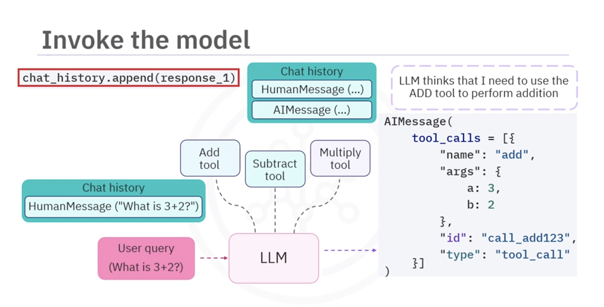

# Build Interactive LLM Agents

## 1. Overview

This lesson explains how to build **interactive LLM agents** that:

- Understand user queries
- Select appropriate tools
- Extract tool arguments
- Execute tools
- Return natural language responses

The system moves from **basic tool integration → fully interactive agent workflow**.

---

# 2. Agent Workflow

An interactive agent follows a multi-step process.



```
User Query
↓
Add query to chat history
↓
LLM analyzes query
↓
LLM selects tool + parameters
↓
System executes tool
↓
Tool result returned to LLM
↓
LLM generates final response

```

---

# 3. Step 1: Create the User Query

Example query:

```

What is 3 plus 2?

````

The query must be inserted into **chat history** so the model understands the conversation context.

---

# 4. Step 2: Convert Query to HumanMessage

LangChain uses message types to structure conversations.

Import the message wrapper:

```python
from langchain_core.messages import HumanMessage
````

Wrap the query:

```python
HumanMessage(content="What is 3 plus 2?")
```

### Purpose

* Identifies the message as coming from the **user**
* Helps the LLM understand the **conversation structure**

---

# 5. Step 3: Build Chat History

Create a list to store conversation messages.

Example:

```python
chat_history = [
    HumanMessage(content="What is 3 plus 2?")
]
```

### Chat History Stores

* user messages
* model responses
* tool results

This ensures the model always has **complete conversation context**.

---

# 6. Step 4: Run the Tool-Enabled Model

Send the chat history to the LLM.

```python
response = llm_with_tools.invoke(chat_history)
```

The model will:

1. Review the conversation
2. Identify the correct tool
3. Extract tool parameters
4. Suggest a tool call

---

# 7. Model Output (AIMessage)

The model does not immediately return text.

Instead it returns an **AIMessage containing tool call instructions**.

Structure example:

```json
{
 "tool_calls": [
   {
     "name": "add",
     "args": {"a": 3, "b": 2},
     "id": "call_123",
     "type": "tool_call"
   }
 ]
}
```

---

# 8. Tool Call Components

Each tool call contains several important fields.

| Field | Purpose             |
| ----- | ------------------- |
| name  | tool to execute     |
| args  | input parameters    |
| id    | unique identifier   |
| type  | indicates tool call |

Example:

```
name = "add"
args = {a:3, b:2}
```

---

# 9. Step 5: Extract Tool Call Data

Retrieve the tool calls list.

Example:

```python
tool_calls = response.tool_calls
```

Extract tool name:

```python
tool_name = tool_calls[0]["name"]
```

Extract arguments:

```python
tool_args = tool_calls[0]["args"]
```

Extract tool ID:

```python
tool_id = tool_calls[0]["id"]
```

---

# 10. Step 6: Execute the Tool

Use the **tool mapping dictionary** created earlier.

Example:

```python
tool_map = {
    "add": add,
    "subtract": subtract,
    "multiply": multiply
}
```

Call the tool dynamically:

```python
result = tool_map[tool_name].invoke(tool_args)
```

Example result:

```
5
```

---

# 11. Step 7: Send Tool Result Back to the LLM

Wrap the result in a **ToolMessage**.

Import:

```python
from langchain_core.messages import ToolMessage
```

Create message:

```python
ToolMessage(
    content=str(result),
    tool_call_id=tool_id
)
```

### Purpose

Links the tool result to the **original tool request**.

---

# 12. Step 8: Update Chat History

Append messages to chat history.

Updated history contains:

1. HumanMessage
2. AIMessage (tool request)
3. ToolMessage (tool result)

Example:

```python
chat_history.append(response)
chat_history.append(tool_message)
```

---

# 13. Step 9: Generate Final Response

Send updated history back to the model.

```python
final_response = llm_with_tools.invoke(chat_history)
```

The LLM now:

* reads the tool output
* formats a natural answer

Example response:

```
The result of 3 plus 2 is 5.
```

---

# 14. Automating the Process with an Agent Class

Instead of manually performing each step, create an **agent class**.

Example class:

```
ToolCallingAgent
```

Responsibilities:

* bind tools to LLM
* manage chat history
* parse tool calls
* execute tools
* return final response

---

# 15. Agent Class Workflow

The agent handles the entire pipeline.

```
User Query
     ↓
Add to chat history
     ↓
LLM suggests tool
     ↓
Agent extracts tool name & args
     ↓
Agent executes tool
     ↓
Result added to history
     ↓
LLM generates final response
```

---

# 16. Handling Imperfect Queries

Agents can interpret **natural language variations**.

Example queries:

```
1 minus 2
```

```
subtract 2 from 5
```

The LLM determines **intent** and selects the correct tool.

---

# 17. Multiple Tool Calls

LLMs may request **multiple tools simultaneously**.

Example:

```
(2 + 3) * 4
```

Possible steps:

1. add(2,3)
2. multiply(result,4)

Tool call IDs ensure responses are **linked correctly**.

---

# 18. Key Components of Interactive Agents

| Component    | Purpose                |
| ------------ | ---------------------- |
| HumanMessage | user input             |
| AIMessage    | model output           |
| ToolMessage  | tool result            |
| chat history | conversation context   |
| tool map     | dynamic tool execution |
| agent class  | automation             |

---

# 19. Key Takeaways

In this lesson you learned to:

* Structure conversations using **chat history**
* Convert user input into **HumanMessage**
* Extract **tool names and arguments**
* Execute tools dynamically
* Return results via **ToolMessage**
* Build **agent classes** to automate the process

---

# 20. Final Insight

Interactive agents transform LLMs from **passive text generators** into **decision-making systems capable of interacting with tools and performing real-world tasks**.

