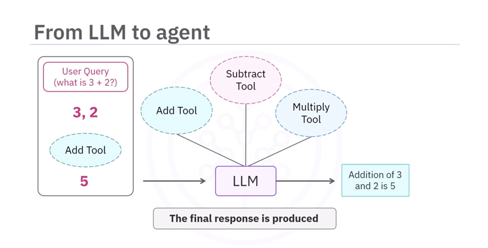

# Build LLM Agents with Tools (Manual Tool Calling)

## 1. Overview

This lesson introduces **manual tool calling**, an early step toward building **LLM-powered agents**.

Key objectives:

- Initialize a **chat model for tool interaction**
- Create **custom tools**
- Bind tools to the LLM
- Enable **dynamic function calling**
- Build a simple **math agent**

This process turns a **basic LLM into an interactive system** that can perform actions.

---

# 2. What is Manual Tool Calling?

Manual tool calling allows an **LLM to identify and suggest a tool**, while the system executes it through defined functions.

Example query:

```

What is 3 + 2?

```

Workflow:

```

User Query
↓
LLM identifies tool
↓
Extract parameters (3,2)
↓
Call addition tool
↓
Tool computes result
↓
LLM returns final answer

```

Result:

```

3 + 2 = 5

````

---

# 3. Step 1: Initialize the Chat Model

The first step is creating the **LLM instance**.

Import the chat model initializer:

```python
from langchain.chat_models import initChatModel
````

Initialize the model:

```python
llm = initChatModel(
    model="gpt-4.0-mini",
    model_provider="openai"
)
```

### Purpose

* Connects your application to the LLM
* Enables **sending and receiving messages**
* Allows tool interactions

When you see:

```
llm.invoke()
```

It means the application is interacting with this model instance.

---

# 4. Step 2: Define a Custom Tool

Tools are functions the LLM can call to perform tasks.

Import the tool decorator:

```python
from langchain.tools import tool
```

Create an **addition tool**.

```python
@tool
def add(a: int, b: int):
    """Add a and b"""
    return a + b
```

### Important Components

| Component     | Purpose                               |
| ------------- | ------------------------------------- |
| `@tool`       | Marks function as callable tool       |
| function name | Tool identifier                       |
| parameters    | Inputs used by tool                   |
| docstring     | Helps LLM decide when to use the tool |

---

# 5. Step 3: Bind Tools to the LLM

Tools must be **connected to the model** before they can be used.

Create a tools list:

```python
tools = [add]
```

Bind tools to the model:

```python
llm_with_tools = llm.bind_tools(tools)
```

### Result

The LLM now **knows the tool exists** and can suggest using it when needed.

---

# 6. Step 4: Add More Tools

Expand the system with more arithmetic tools.

### Subtraction Tool

```python
@tool
def subtract(a: int, b: int):
    """Subtract b from a"""
    return a - b
```

### Multiplication Tool

```python
@tool
def multiply(a: int, b: int):
    """Multiply a and b"""
    return a * b
```

Now the agent can handle:

* addition
* subtraction
* multiplication

---

# 7. Creating a Tool List

Combine tools into a list.

```python
tools = [
    add,
    subtract,
    multiply
]
```

Bind tools again:

```python
llm_with_tools = llm.bind_tools(tools)
```

Now the LLM can choose **any of these tools**.

---

# 8. Mapping Dictionary for Dynamic Function Calls

Sometimes tools must be **called dynamically by name**.

Create a **mapping dictionary**.

```python
tool_map = {
    "add": add,
    "subtract": subtract,
    "multiply": multiply
}
```

This links **tool names → functions**.

---

# 9. Dynamic Tool Execution

Define input parameters.

```python
inputs = {
    "a": 1,
    "b": 2
}
```

Call tool dynamically:

```python
tool_map["add"].invoke(inputs)
```

### What Happens

1. `"add"` retrieves the function from dictionary
2. `invoke()` runs the tool
3. Input keys match function parameters
4. Tool executes

Result:

```
3
```

---

# 10. Full Workflow

The complete agent pipeline:

```
User Query
      ↓
LLM analyzes question
      ↓
Selects correct tool
      ↓
Extracts parameters
      ↓
Tool executed
      ↓
Tool returns result
      ↓
LLM formats response
```

Example:

```
User: What is 4 × 3?
```

Process:

* LLM selects **multiply tool**
* Parameters: `a=4, b=3`
* Tool executes
* Result returned

Output:

```
12
```

---

# 11. Chat History Support

LLMs can maintain **conversation context**.

Example conversation:

```
User: What is 3 + 2?
Assistant: 5

User: Multiply that by 4
Assistant: 20
```

Maintaining **chat history** improves:

* context awareness
* conversational accuracy
* personalized responses

---

# 12. Key Concepts

### Tools

Functions that perform tasks for the LLM.

### Chat Model

Handles conversations and tool interactions.

### Binding Tools

Connects tools to the LLM.

### Mapping Dictionary

Allows dynamic function execution.

---

# 13. Benefits of Tool-Enabled LLMs

Tool integration enables LLMs to:

* perform calculations
* access external data
* interact with APIs
* execute workflows

This transforms the LLM into a **real-world interactive agent**.

---

# 14. Key Takeaways

In this lesson you learned to:

* Initialize a **chat model**
* Create **custom tools**
* Bind tools to the LLM
* Expand functionality with **multiple tools**
* Use **mapping dictionaries** for dynamic tool execution
* Enable LLMs to **select tools and process parameters**

---

# 15. Final Insight

Tool-enabled LLMs move beyond simple text generation.

They become **interactive agents capable of reasoning and performing actions in real-world systems**.

