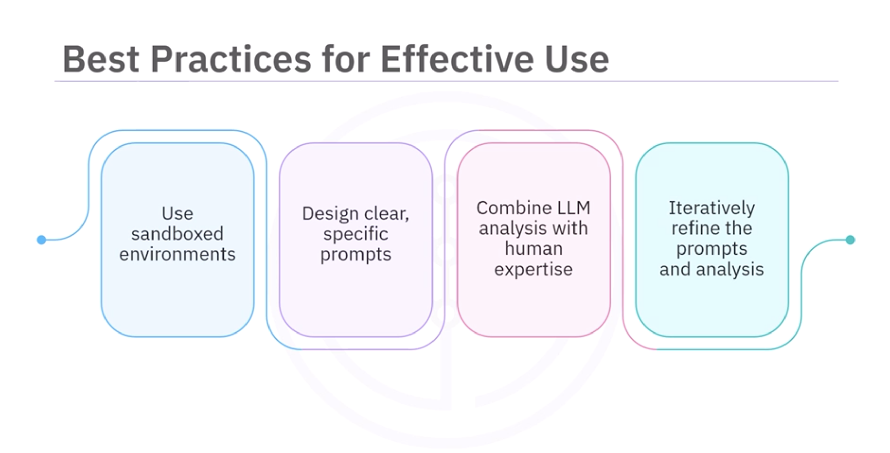

# LangChain Pandas DataFrame Agent — Revision Notes

## 1. Purpose

The **LangChain Pandas DataFrame Agent** allows users to:

* Analyze data
* Generate insights
* Create visualizations

using **natural language queries** on a **Pandas DataFrame**.

Best suited for:

* Data exploration
* Rapid prototyping

⚠️ Not recommended for **production environments** without strong safeguards.

---

## 2. Key Characteristics



### Preconfigured Setup

`create_pandas_dataframe_agent`:

* Includes **built-in prompts**
* Includes **preconfigured functions**
* Saves development time.

### Works Directly With DataFrame

The agent:

* Operates on an **existing Pandas DataFrame**
* Uses **LLM reasoning to generate Python code**

### Natural Language Interaction

User prompt → Agent generates code → Executes → Returns result.

Possible outputs:

* Numeric values
* Summaries
* Charts / visualizations

---

## 3. Required Libraries

```python
import pandas as pd
```

Dataset example:

* **Student Alcohol Consumption dataset (UCI ML)**

Preview dataset:

```python
df.head()
```

Example fields:

* `sex` → gender (M / F)
* `age` → numeric (15–22)

---

## 4. IBM watsonx.ai Model Setup

### Import Generation Parameters

```python
from ibm_watsonx_ai.metanames import GenTextParamsMetaNames as GenParams
```

### Configure Model

Example model:

* **Llama-3 70B**

Configuration includes:

* `model_id`
* `generation parameters`
* `project_id`
* `space_id`

---

## 5. Connecting watsonx Model to LangChain

### Import Required Classes

```python
from ibm_watsonx_ai.foundation_models import Model
from langchain_ibm import WatsonxLLM
```

### Initialize LLM

Provide:

* model id
* parameters
* project id
* space id

This integrates **watsonx LLM with LangChain tools**.

---

## 6. Creating the Pandas Agent

Import agent:

```python
from langchain_experimental.agents import create_pandas_dataframe_agent
```

Create agent:

```python
agent = create_pandas_dataframe_agent(
    llm,
    df,
    verbose=True,
    return_intermediate_steps=True
)
```

### Parameters

| Parameter                        | Purpose                        |
| -------------------------------- | ------------------------------ |
| `llm`                            | Connected language model       |
| `df`                             | Pandas DataFrame               |
| `verbose=True`                   | Shows execution details        |
| `return_intermediate_steps=True` | Displays generated Python code |

---

## 7. Querying the Data

Example query:

```python
agent.invoke("How many rows are in this file?")
```

Output:

```text
395 rows
```

Generated code example:

```python
len(df)
```

---

## 8. Example Data Analysis Query

Prompt:

```text
How many students are 18 years old?
```

Result:

```text
82 students
```

Generated code logic:

```python
df[df["age"] == 18]
len(...)
```

---

## 9. Generating Visualizations

Example prompt:

```text
Plot the gender count with bars
```

Agent will:

1. Interpret **gender → sex column**
2. Generate Python visualization code
3. Output a **bar chart**

No manual coding required.

---

## 10. How the Agent Works Internally

Process:

```text
User Prompt
     ↓
LLM interprets query
     ↓
Generates Python code
     ↓
Code executes on DataFrame
     ↓
Returns answer / chart
```

---

## 11. Viewing Generated Code

Because of:

```python
return_intermediate_steps=True
```

You can inspect:

* filtering logic
* aggregation operations
* plotting code

Useful for:

* debugging
* understanding reasoning

---

## 12. Best Practices (Important)

### 1. Use Sandboxed Environments

Prevents:

* modification of live data
* malicious code execution

### 2. Avoid Prompt Injection

Do not allow unsafe prompts that could run harmful code.

### 3. Write Clear Prompts

Example:

Good:

```text
Count students aged 18
```

Bad:

```text
Tell me something about age
```

### 4. Validate Results

Always confirm:

* correct dataset used
* correct calculations performed

### 5. Iterative Prompting

Refine prompts to improve results.

---

## 13. Why It’s Useful

Advantages:

* No manual coding
* Faster data exploration
* Auto-generated Python code
* Easy visualization creation
