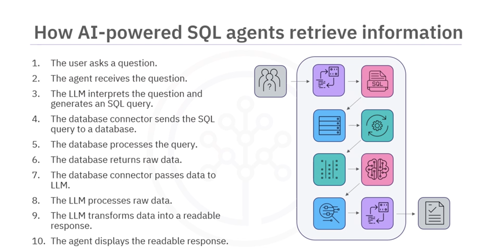

# AI-Powered SQL Agents – Quick Revision Notes

## 1. What Are AI-Powered SQL Agents?
AI-powered SQL agents use **Large Language Models (LLMs)** to convert **natural language questions** into **SQL queries**, allowing users to access database information without deep SQL knowledge.

---

# 2. Benefits
- Bridge the gap between **natural language and SQL**
- Improve **data accessibility**
- Allow **non-technical users** to query databases
- Reduce the need for deep SQL expertise
- Provide **clear, readable responses** from database results

---

# 3. Key Capabilities

### Schema Understanding
- Agents **read and interpret database schemas**
- Identify **relevant tables**
- Retrieve only necessary schema information to stay efficient

### Query Support
- Generate SQL queries from natural language
- Support **multi-step querying** when one query is not enough

### Error Handling
- Detect query errors
- Analyze **tracebacks**
- Automatically **retry corrected queries**

---

# 4. Limitations & Considerations
- AI may **misinterpret user queries**
- **Complex queries** might require manual adjustment
- Results require **testing and validation**
- Reliability improves with **continuous monitoring**

---

# 5. How AI-Powered SQL Agents Work (Process Flow)

1. User asks a **question in natural language**
2. AI SQL Agent receives the question
3. **LLM interprets** the request
4. LLM **generates an SQL query**
5. **Database connector** sends query to database
6. **Database executes query**
7. Database returns **raw data**
8. Connector sends data back to LLM
9. LLM **parses and formats** the results
10. AI agent returns a **clear natural language response**

---

# 6. Key Takeaways
- AI SQL agents enable **natural language database queries**
- They **read schemas, generate SQL, fix errors, and format results**
- They improve **data accessibility for non-technical users**
- **Accuracy limitations exist**, so validation is important