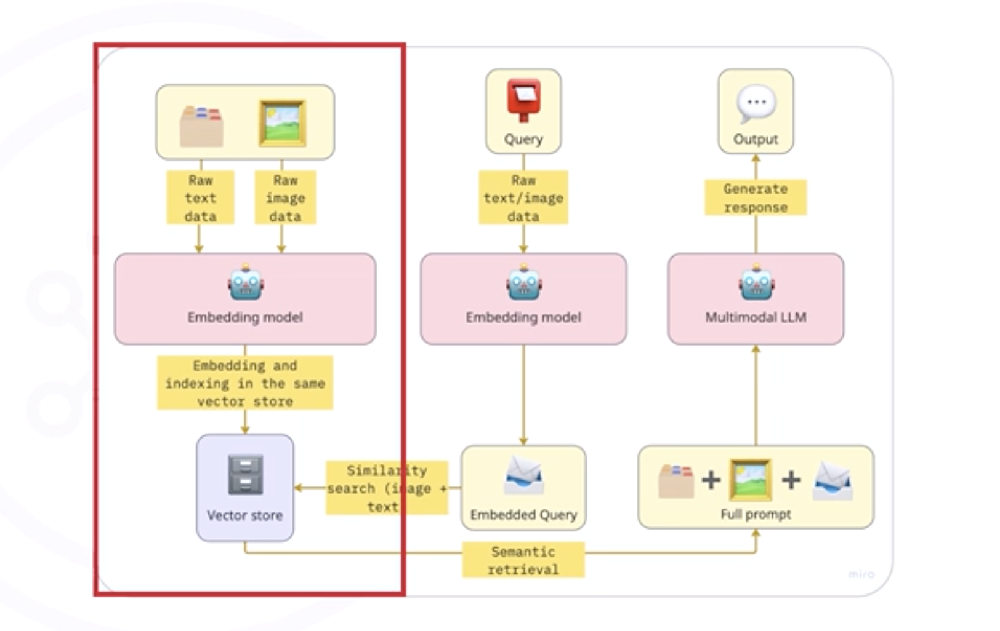

# Introduction to Multimodal Retrieval Augmented Generation (MM-RAG)

## Learning Objectives

After studying MM-RAG, you should be able to:

* Explain how AI systems retrieve and generate information across **multiple data modalities**.
* Demonstrate the **integration of diverse data types** into retrieval processes.
* Design **generative models using multimodal context**.

---

# What is MM-RAG?

**MM-RAG (Multimodal Retrieval Augmented Generation)** combines:

1. **Multimodal AI**
2. **Retrieval Augmented Generation (RAG)**
3. **Generative Models**

It allows AI systems to understand and generate responses using **multiple data types**, such as:

* Text
* Images
* Audio
* Video

### Core Idea

An AI system can:

* Analyze **visual inputs (images/videos)**
* Retrieve **relevant information from databases**
* Generate **accurate contextual responses**

---

# Key Concepts

## Multimodal Systems

Multimodal AI systems process **multiple types of data simultaneously**.

Common modalities:

* Text
* Images
* Video
* Audio

Example:
A system that analyzes an **image of a cat** and connects it with the phrase **“domestic feline.”**

---

## Retrieval Augmented Generation (RAG)

RAG improves LLM responses by retrieving **external knowledge**.

LLMs like:

* Llama 4
* GPT-4o
* Claude 3

can analyze images but **cannot access your private datasets**.

RAG solves this by retrieving information from:

* Vector databases
* Knowledge bases
* Proprietary datasets

---

## Generation

The final step where the model:

* Uses the **retrieved data**
* Combines it with **user input**
* Produces a **grounded and accurate response**

---

# MM-RAG Architecture

The typical MM-RAG pattern consists of **three main components**.

## 1. Multimodal Retrieval

Specialized retrievers fetch relevant data across modalities:

* Text documents
* Images
* Audio recordings
* Videos

---

## 2. Contrastive Learning

Contrastive learning aligns different data modalities into **similar vector representations**.

Example mapping:

| Data Type | Example           |
| --------- | ----------------- |
| Image     | Picture of a cat  |
| Text      | “Domestic feline” |

Both are mapped to **similar embeddings**, enabling cross-modal retrieval.

---

## 3. Multimodal Generation

A generative model uses the **retrieved multimodal context** to produce responses grounded in richer information.

---

# MM-RAG Pipeline

The MM-RAG implementation typically follows **four steps**.

---

## 1. Data Indexing

All data types are converted into **embeddings**.

Data sources may include:

* Text
* Images
* Audio
* Video

These embeddings are stored in a **vector database**.

Purpose:

* Enable **semantic search**
* Structure unstructured data

---

## 2. Data Retrieval

When a user query is received:

1. Convert the query into an **embedding**
2. Search the **vector database**
3. Retrieve **semantically similar data**

The query can be:

* Text
* Image
* Multimodal input

---

## 3. Augmentation

Retrieved data is **combined with the original query**.

This creates **enhanced context** for the generative model.

Example context:

* Image
* Product metadata
* Related descriptions

---

## 4. Response Generation

The augmented query is sent to a **multimodal generative model**.

The model generates responses using:

* User input
* Retrieved context
* Multimodal data

---

# Practical Example: Style Finder Application

**Style Finder** is an example MM-RAG system.

Purpose:

* Users upload **outfit images**
* The system identifies **fashion items**
* Returns **purchase links and details**

---

# Application Workflow

## 1. Image Encoding

The uploaded image is converted into a **feature representation**.

Implementation details:

* Model: **ResNet50**
* Library: `torchvision`

Output:

* Image embedding vector
* Base64 encoded image

These embeddings enable **similarity comparison**.

---

## 2. Similarity Search

The system compares the image embedding against a dataset of **pre-encoded vectors**.

Similarity metric used:

**Cosine Similarity**

Steps:

1. Compare embeddings
2. Find the **closest matching outfit**
3. Retrieve related fashion items

---

## 3. Context Retrieval

Once a matching outfit is found, the system retrieves **structured metadata**, such as:

* Product name
* Price
* Purchase URL

This information becomes **context for the LLM prompt**.

---

## 4. Prompt Construction

The prompt sent to the multimodal model includes:

* Base64 image
* Structured product data
* Instructions for analysis

Prompt instructions guide the model to describe:

* Materials
* Patterns
* Colors
* Similar items

---

## 5. Response Generation

The prompt is sent to a **vision-language model** such as:

* **Llama Vision Instruct**

The model generates a **structured Markdown response** containing:

* Visual reasoning
* Product analysis
* Item recommendations

---

# Summary

MM-RAG combines:

* **Multimodal inputs**
* **Retrieval-Augmented Generation**
* **Generative AI**

## Three Core Components

1. Multimodal retrieval
2. Contrastive embedding learning
3. Generative models using multimodal context

---

## Four-Step MM-RAG Pipeline

| Step                | Description                                  |
| ------------------- | -------------------------------------------- |
| Data Indexing       | Convert multimodal data into embeddings      |
| Data Retrieval      | Retrieve relevant data using semantic search |
| Augmentation        | Combine retrieved context with the query     |
| Response Generation | Generate multimodal responses                |

